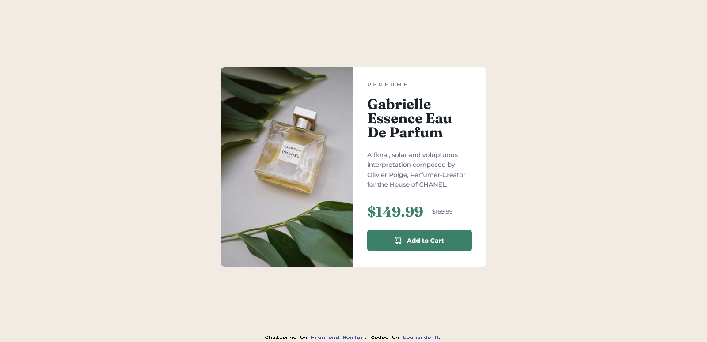
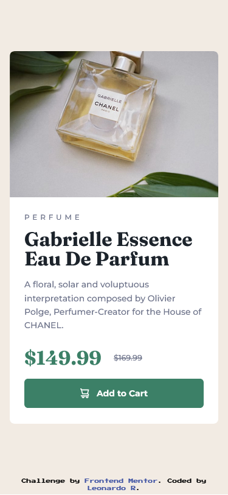

# Frontend Mentor - Product preview card component solution

This is a solution to the [Product preview card component challenge on Frontend Mentor](https://www.frontendmentor.io/challenges/product-preview-card-component-GO7UmttRfa). Frontend Mentor challenges help you improve your coding skills by building realistic projects. 

## Table of contents

- [Overview](#overview)
  - [The challenge](#the-challenge)
  - [Screenshot](#screenshot)
  - [Links](#links)
- [My process](#my-process)
  - [Built with](#built-with)
  - [What I learned](#what-i-learned)
  - [Continued development](#continued-development)
  - [Useful resources](#useful-resources)
- [Author](#author)

## Overview

A product preview card component created with Angular, Tailwind CSS and components.

### The challenge

The challenge is to build out this product preview card component and get it looking as close to the design as possible.

You can use any tools you like to help you complete the challenge. So if you've got something you'd like to practice, feel free to give it a go.

Your users should be able to:

- View the optimal layout depending on their device's screen size
- See hover and focus states for interactive elements

### Screenshot

### Links

- Live Site URL: [GitHub Pages](https://leozende.github.io/product-preview-card-component/)

## My process

Well, first I tried to prepare the Angular and Tailwind environment. (I ended up forcing something I shouldn't have and had to recreate the project)
Afterwards, I separated the components, with a little doubt as to whether I should leave the footer in the home page, but in the end I decided to leave it there.
So it was the html part, in which I made each component a separate html,
so there were several head and main.
Finally, I used tailwind CSS for styling.

### Built with

- Semantic HTML5 markup
- CSS/Tailwind CSS custom properties
- Flexbox
- Mobile-first workflow
- Components
- Angular

### What I learned

I learned how to configure angular along with tailwind CSS.

### Continued development

I needed to work on the dynamic part of it, so I could create cards with the same structure, but with different descriptions and images.

### Useful resources

- [Tailwind CSS](https://tailwindcss.com) - Helped me with styling.
- [Angular blog](https://blog.angular.io) - To be able to see the new updates and changes in Angular 17.
- [Revert GitHub Commit](https://gist.github.com/gunjanpatel/18f9e4d1eb609597c50c2118e416e6a6) - I made some wrong commits and had to revert.

## Author

- Website - [GitHub Leonardo R](https://github.com/leozende)
- Frontend Mentor - [@leozende](https://www.frontendmentor.io/profile/leozende)
